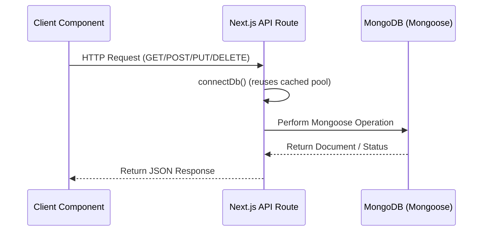

# 🛠️ Next.js + Zustand Notes App - Developer Reference

This reference guide provides deep-dive instructions for developing and contributing to the **Next.js & Zustand Notes App**. For a general setup guide, please see the [README.md](file:///c:/code/React_Nextjs_Hitesh_Udemy/Next_js/module-6-note_app_zustand/README.md).

---

## 🗄️ Database Architecture & Schemas

The application connects to MongoDB using Mongoose. The connection is pooled in [lib/db.js](file:///c:/code/React_Nextjs_Hitesh_Udemy/Next_js/module-6-note_app_zustand/lib/db.js).

### Mongoose Note Schema (`lib/models/note.js`)

```javascript
import mongoose, { Schema } from "mongoose";

const noteSchema = new Schema({
    title: {
        type: String,
        required: true
    },
    content: {
        type: String,    
        required: true
    },
}, { timestamps: true });

export const Note = mongoose.models.Note || mongoose.model("Note", noteSchema);
```

### Database Integration Flow



---

## ⚡ Client-Side State Management

### Zustand Store Configuration (`store/useNotesStore.js`)

The store is configured in [store/useNotesStore.js](file:///c:/code/React_Nextjs_Hitesh_Udemy/Next_js/module-6-note_app_zustand/store/useNotesStore.js). It includes async side-effects (calling the REST APIs) and updating the store state.

**State Fields:**
- `notes` (array): The list of fetched notes, sorted newest first.
- `loading` (boolean): Flag for active server operations.
- `error` (string | null): The current error message if an operation fails.

**Action Methods:**
- `fetchNotes()`: Requests `GET /api/notes` and updates the `notes` list.
- `createNote(title, content)`: Requests `POST /api/notes`, pushes the new note to the top of the array, and returns the created note.
- `deleteNote(id)`: Requests `DELETE /api/notes/[id]` and filters out the deleted note by ID.
- `updateNote(id, title, content)`: Requests `PUT /api/notes/[id]` and replaces the updated note in the store array.

> [!WARNING]
> **Integration Gap**: Currently, the client components ([app/page.js](file:///c:/code/React_Nextjs_Hitesh_Udemy/Next_js/module-6-note_app_zustand/app/page.js) and [components/editPage.jsx](file:///c:/code/React_Nextjs_Hitesh_Udemy/Next_js/module-6-note_app_zustand/components/editPage.jsx)) perform direct `fetch` API requests and manage state using React's `useState` hooks. Refactoring them to utilize `useNotesStore` will improve maintainability and performance.

---

## 🎨 Styles & Tailwind CSS 4 configuration

This project uses **Tailwind CSS v4**. 

- **Global Directives**: Configured in [app/globals.css](file:///c:/code/React_Nextjs_Hitesh_Udemy/Next_js/module-6-note_app_zustand/app/globals.css) via `@import "tailwindcss"`.
- **Custom Themes**: Declared inline in the CSS configuration block:
  ```css
  @theme inline {
    --color-background: var(--background);
    --color-foreground: var(--foreground);
    --font-sans: var(--font-geist-sans);
    --font-mono: var(--font-geist-mono);
  }
  ```

---

## 🚦 Local Operations

### Prerequisites
- **Node.js**: v18+ recommended.
- **MongoDB**: A running local MongoDB server or a remote MongoDB Atlas cluster.

### Development Sandbox
To start the developer environment:
```bash
npm run dev
```

### Static Code Validation
Ensure all components adhere to formatting rules and Next.js requirements:
```bash
npm run lint
```

### ⚠️ Known Code Quality & Linting Issues
When running `npm run lint`, you may encounter the following error:
- **Location**: `app/page.js` (line 35)
- **Error**: `react-hooks/set-state-in-effect` — "Avoid calling setState() directly within an effect."
- **Reason**: The `fetchNotes()` action updates state synchronously inside a `useEffect` callback without wrapping or cleanup.
- **Resolution**: Refactoring the app to use the Zustand store actions directly in interaction events (rather than fetching and setting state inside the mount `useEffect`) will cleanly resolve this lint error.

