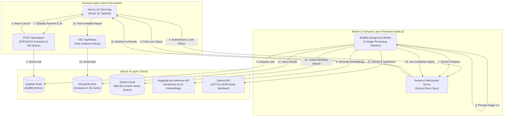

# Portfolio & Resume Reference: AI Resume Analyzer

This document serves as a comprehensive portfolio resource and resume summary for the **AI Resume & ATS Analyzer** project. It includes copy-pasteable resume bullet points, a detailed project case study, and a tech stack breakdown.

---

## 1. Resume Bullet Points

### **AI & Software Engineer / Full Stack Developer**

*   **Architected a Distributed AI Pipeline**: Built a production-grade, distributed AI resume critique and ATS matching engine utilizing **Next.js 15 (React 19)** on Vercel and a persistent **Node.js/Express** backend to handle 30–90 second processing jobs with sub-10ms API response times.
*   **Event-Driven Worker Architecture**: Designed a decoupled, event-driven background worker pipeline powered by **BullMQ** and **Upstash Redis** to bypass serverless execution limits, streaming real-time stage progress (0–100%) to clients via **Socket.io WebSockets**.
*   **Custom Semantic Text Parsing**: Engineered a section-aware parsing and text normalization algorithm resolving Unicode ligatures, soft hyphens, and whitespace formatting issues to enforce deterministic structures before ingestion.
*   **Vector Search & Semantic Scoring**: Integrated **Qdrant Cloud** and **HuggingFace Inference API (`all-MiniLM-L6-v2`)** to index and query 384-dimensional section embeddings, applying custom relevance weights (e.g., Experience: 2.0x, Skills: 1.8x) to compute semantic alignment and identify skill gaps.
*   **Structured LLM Synthesis**: Orchestrated a multi-stage **OpenAI GPT-4o (JSON Mode)** pipeline to perform structured role-rubric generation, keyword coverage analyses, seniority mismatch detection, and action-verb/metric-oriented resume bullet rewrites.
*   **Cost & Latency Optimization**: Implemented a content-addressable caching layer in **MongoDB Atlas** using SHA-256 job description hashing, saving ~$0.02 per duplicate search and reducing execution latency by ~5 seconds.
*   **Secured WebSocket Channels**: Developed a **3-Guard Model** for WebSockets using **Clerk JWT Authentication** and BullMQ, enforcing token validity, job existence, and user job ownership checks to protect data privacy.

---

## 2. Portfolio Case Study / Project Page

### **AI Resume & ATS Analyzer**
*A production-grade, distributed AI pipeline that evaluates resumes against job descriptions with semantic vector search and LLM-guided critique.*

### **Project Overview**
Applying to jobs in the modern market is often a black box governed by Applicant Tracking Systems (ATS). This project was built to empower job seekers by providing a high-fidelity, transparent evaluation of how their resume aligns with any specific job description. 

Instead of relying on basic keyword density tools, this application models the resume and job description semantically using vector search, executes a multi-stage deterministic pipeline, and returns a tailored analysis complete with an ATS compatibility check, a seniority mismatch warning, categorized skill gaps, and AI-rewritten resume bullets.

### **Key Architectural Pillars**

#### **1. Decoupled Compute & Serverless Timeout Bypass**
Complex AI pipelines involving text extraction, multiple LLM requests, vector database indexing, and similarity scoring typically take **30 to 90 seconds**. Serverless platforms like Vercel have a strict execution limit (typically 10–15 seconds). 

To solve this, the application separates concern:
*   **Next.js 15 App Router** acts as a stateless API gateway. It accepts the file upload, parses the PDF/DOCX buffer, and pushes the job to a **BullMQ** queue backed by **Upstash Redis** in under 15ms.
*   A persistent **Node.js Express backend** hosts the BullMQ worker, running the compute-heavy pipeline asynchronously without blocking the user interface.
*   **Socket.io WebSockets** keep the frontend and worker in sync. As each stage of the worker pipeline executes, it pushes precise telemetry (e.g., `"Stage 4/6: Chunking text semantically...", 55%`) to the client, preventing dead loading spinners.

#### **2. Custom Section-Aware Semantic Chunking**
Standard chunking libraries (e.g. splitting text by raw character counts) split documents indiscriminately, which mixes different contexts (e.g., mixing "Experience" bullet points with "Education" or "Skills" sections). This ruins the accuracy of vector searches.

I built a custom, line-by-line parser that:
1.  Identifies candidate headers based on structures extracted in the mapping stage.
2.  Splits the text at canonical section boundaries (Experience, Education, Skills, Projects, Summary).
3.  Pre-pends a section-specific token (e.g., `[EXPERIENCE] ` or `[SKILLS] `) to each sentence-level chunk before embedding it using **HuggingFace's `all-MiniLM-L6-v2`** model.
4.  Weights search results dynamically during similarity scoring (e.g., an experience match is scored higher than a project match) to reflect how human recruiters scan resumes.

#### **3. Content-Addressable JD Intelligence Cache**
Job descriptions are often reused across multiple applications. Calling the LLM to extract requirements (seniority, must-have skills, nice-to-have skills) on every upload creates unnecessary cost and latency.

By implementing a **SHA-256 content-addressable cache** on the job description text:
*   Subsequent analyses of the same job description fetch pre-computed requirements directly from **MongoDB Atlas**.
*   This bypasses the initial 5-second LLM call, reducing pipeline latency and saving OpenAI API token costs.

#### **4. The 3-Guard WebSocket Security Protocol**
Real-time progress telemetry requires opening direct communication rooms. To prevent unauthorized users from eavesdropping on another candidate's active extraction, a 3-Guard security check is executed when joining a socket room:
1.  **Guard A (Identity)**: Extracts the JWT session token from the connection and verifies it against **Clerk Backend** middleware.
2.  **Guard B (Existence)**: Validates that the requested `jobId` exists in the BullMQ queue.
3.  **Guard C (Ownership)**: Verifies that the `clerkUserId` attached to the job metadata matches the authenticated socket client's ID.

---

## 3. The 6-Stage Processing Pipeline

The core worker pipeline (`backend/worker.ts`) operates deterministically through the following phases:

| Stage | Name | Target Progress | Description | Technical Rationale |
| :--- | :--- | :--- | :--- | :--- |
| **1** | **Text Normalization** | **10%** | Cleans raw text, handles Unicode ligatures (e.g., `fi` → `fi`), strips soft hyphens (`\u00AD`), normalizes bullets, and collapses whitespace. | Prevents LLM tokenization errors and ensures exact string matches for keyword scans. |
| **2** | **JD Intelligence Extraction** | **25%** | Extracts structured criteria (required YOE, skills, education) and determines scoring rubric weights based on seniority. | Establishes a customized grading rubric tailored dynamically to the role's seniority tier. |
| **3** | **Resume Mapping & Fact Extraction** | **40%** | Locates section boundaries and extracts core candidate facts (total YOE, education, skills, formatting issues). | Gathers high-confidence facts deterministically to eliminate downstream LLM hallucination. |
| **4** | **Semantic Chunking** | **55%** | Splits resume sections into sentence-level chunks limited to 800 characters, injecting section prefixes. | Prepares text for vectorization, ensuring chunks fit the 256-token limit of the embedding model. |
| **5** | **Semantic Vector Scoring** | **70%** | Generates 384-dim embeddings, stores them in Qdrant, filters by Job ID, and calculates weighted cosine similarity. | Highlights structural skill gaps and rates how closely the candidate matches the requirements semantically. |
| **6** | **Master LLM Synthesis** | **95%** | Compiles all prior data inputs into a master prompt and calls OpenAI GPT-4o (JSON Mode) to generate the final critique. | Offloads calculations to deterministic steps; the LLM merely translates pre-computed facts into feedback. |

---

## 4. Tech Stack Breakdown

### **Frontend & Interface**
*   **Next.js 15 (App Router)** & **React 19**: Framework for the user interface, routing, and serverless API integration.
*   **Tailwind CSS**: Utility-first CSS framework for responsive layout design.
*   **Lucide React**: Vector icons for visual indicators.
*   **Next-Themes**: System-wide dark/light mode toggle.

### **Backend & Asynchronous Processing**
*   **Express & Node.js**: Persistent runtime server for worker execution.
*   **BullMQ** & **ioredis**: Redis-based message queuing system for managing async tasks.
*   **Socket.io & Socket.io-client**: Bi-directional, real-time communication protocol for status telemetry.

### **AI & Machine Learning**
*   **OpenAI SDK (GPT-4o)**: Used with structured JSON schemas (`response_format: { type: "json_object" }`) to generate reliable evaluation payloads.
*   **HuggingFace Inference API**: Computes 384-dimensional vector embeddings using the `sentence-transformers/all-MiniLM-L6-v2` model.
*   **Qdrant Cloud**: Vector database for managing and searching high-dimensional semantic vectors with cosine distance matching.

### **Databases & Authentication**
*   **MongoDB Atlas**: Database for long-term document storage, past analyses, and SHA-256 caching.
*   **Clerk Authentication**: Handles user identities, secure session tokens, and route middleware protection.

---

## 5. Engineering Challenges & Solutions

#### **Challenge: Serverless Timeout Constraints**
*   **Symptom**: Processing a resume against a job description involves PDF text extraction, generating embeddings, querying Qdrant, running multiple LLM prompts, and saving the results. This takes between 30 and 90 seconds. Vercel serverless functions time out after 10–15 seconds, causing HTTP 504 gateway errors.
*   **Solution**: Architected a decoupled worker setup. The frontend API simply parses the document, pushes the data to a BullMQ queue backed by Upstash Redis, and returns a `jobId` immediately. The worker, running on a persistent Express server, consumes the queue. Socket.io was introduced to broadcast progress logs from the worker to the client room, keeping the user informed in real time.

#### **Challenge: Context Contamination in Vector Searches**
*   **Symptom**: General-purpose text splitters split documents by character count. If a chunk contains the end of the "Experience" section and the start of the "Skills" section, its vector representation gets diluted. Searching for experience-related vectors fetches skill list items, and vice versa.
*   **Solution**: Built a custom, section-aware chunker. It identifies section headers like `"Work History"` or `"Professional Experience"` and parses text in a section-by-section boundary. Every chunk text is prefixed with its parent section (e.g. `[EXPERIENCE] Software Engineer at...`) before being sent to the embedding model. When searching Qdrant, a filter is applied to retrieve vectors belonging only to the current target search context, and weighted multipliers are applied depending on the section type (e.g., experience chunks get a 2.0x weight multiplier).
